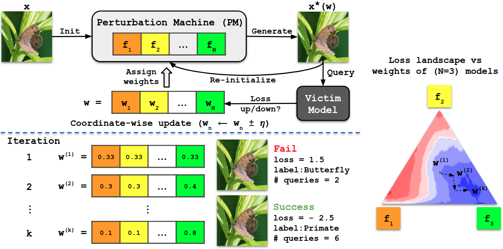

# BASES: Blackbox Attacks via Surrogate Ensemble Search

### [Paper](https://arxiv.org/abs/2208.03610) | [Code](https://github.com/CSIPlab/BASES) | [Poster](https://github.com/CSIPlab/BASES/blob/main/doc/BASES-poster.pdf) | [Slides](https://github.com/CSIPlab/BASES/blob/main/doc/BASES-slides.pdf)
Pytorch implementation of *Blackbox Attacks via Surrogate Ensemble Search* in NeurIPS 2022.

[Blackbox Attacks via Surrogate Ensemble Search](https://arxiv.org/abs/2208.03610)  
 [Zikui Cai](https://zikuicai.github.io/), Chengyu Song, Srikanth V. Krishnamurthy, Amit K. Roy-Chowdhury,
 [M. Salman Asif](https://intra.ece.ucr.edu/~sasif/)<br>
 UC Riverside 

In this paper, we propose a novel method for blackbox attacks via surrogate ensemble
search (BASES) that can generate highly successful blackbox attacks using an
extremely small number of queries. We first define a perturbation machine that
generates a perturbed image by minimizing a weighted loss function over a fixed
set of surrogate models. To generate an attack for a given victim model, we search
over the weights in the loss function using queries generated by the perturbation
machine. Since the dimension of the search space is small (same as the number of
surrogate models), the search requires a small number of queries.

<center> 

</center>


## Environment
See `requirements.txt`, some key dependencies are:

* python==3.8
* torch==1.11.0 


## Perform attacks

### Classifiers

```
# Query in a blackbox setting
python query_w_bb.py --n_wb 20 --victim densenet121

# Learn weights in a whitebox setting
python learn_w_wb.py
```

### Google cloud vision API
[*gcv_images.zip*](https://github.com/CSIPlab/BASES/raw/main/imagenet1000.zip) contains randomly selected images and responses from GCV

```
python gcv_attack.py
```

### Comparison with other methods
Go to [*comparison*](https://github.com/CSIPlab/BASES/tree/main/comparison) folder for more details


